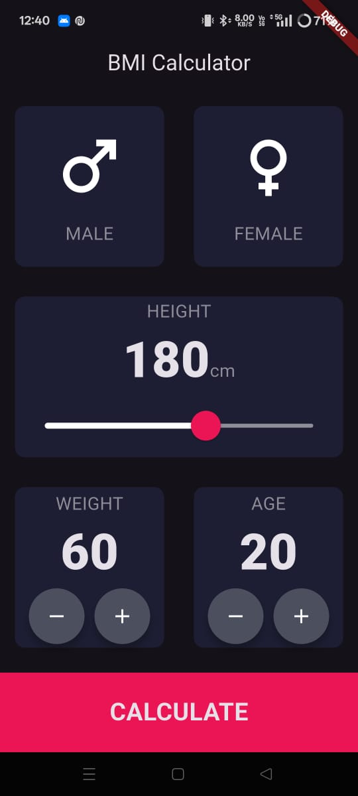

# 🧮 BMI Calculator

A Flutter app that calculates your Body Mass Index (BMI) based on your height and weight, and gives you feedback on your health status with simple visual UI.

---
<table>
  <tr>
    <td></td>
    <td></td>
  </tr>
</table>

## 📌 Features
- Input height and weight
- Select gender
- Calculate BMI instantly
- Get health advice based on BMI
- Clean and reusable UI components

---
## 🛠️ Tech Stack
- Flutter – Cross-platform app framework
- Dart – Programming language
- Material Design – UI components

